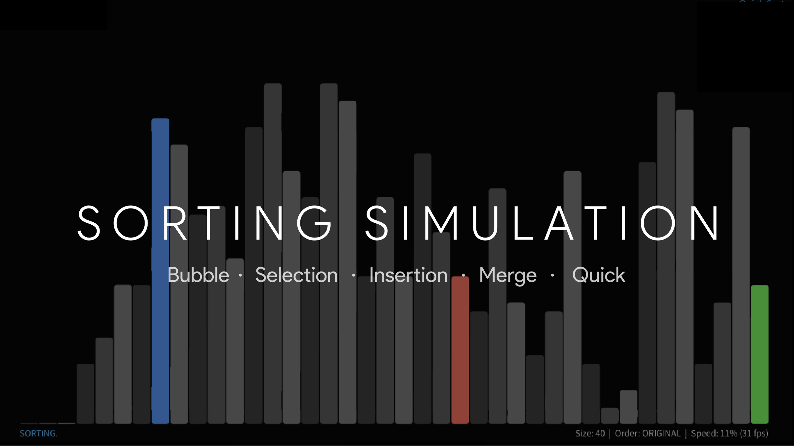
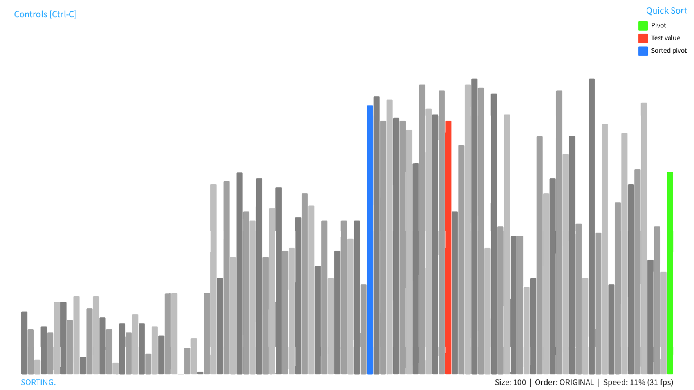
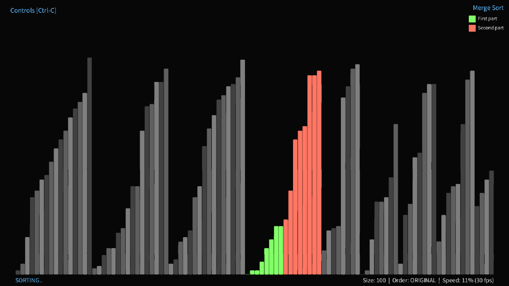
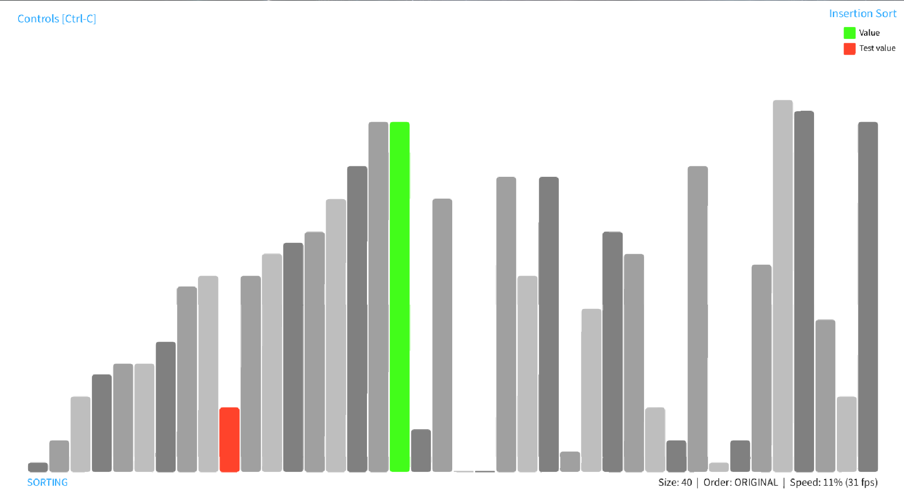
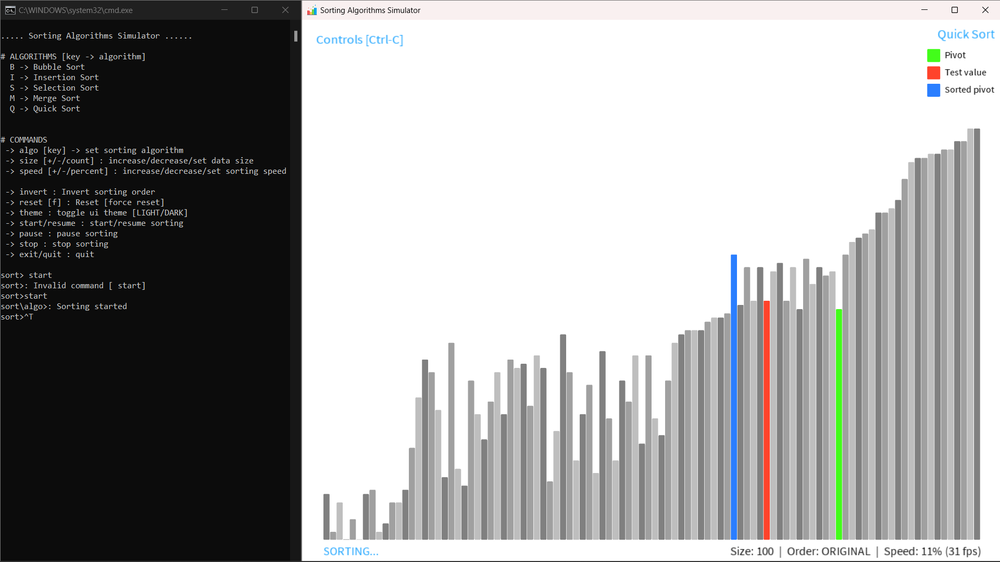
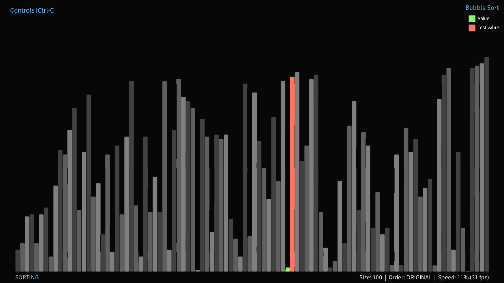
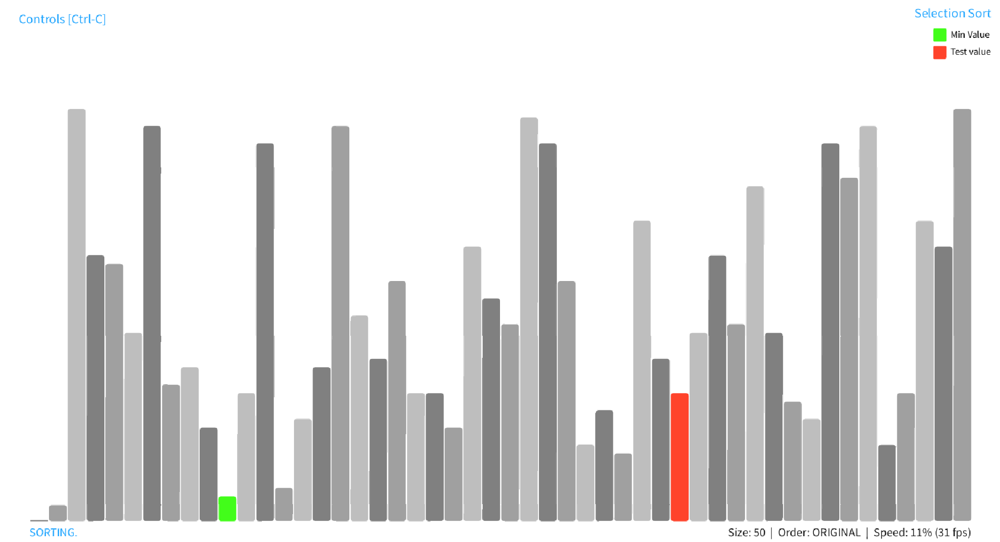

# Sorting Algorithms Simulator

#### This is a modular Sorting Algorithms simulator and visualizer program made with java processing

#### [View Demo on YouTube](https://youtu.be/7IletkkG7TI)

###### See also

[3D N*N Rubik's Cube solver-AI](https://github.com/ChauhanRohan-RC/Cube.git)  
[Fourier Series Simulation](https://github.com/ChauhanRohan-RC/Fourier-Series)  
[3D Chaotic Attractors Simulation](https://github.com/ChauhanRohan-RC/Attractors)

## Overview

* Contains several in-built Sorting Algorithms, with first hand support for implementing custom algorithms
* Real-time colorful visualisation of algorithm parameters, iteration and values
* Both command line and graphical interface controls
* Change the data size, algorithm speed, sort order, color scheme etc

## Algorithms

| Algorithm              | Key | Avg Time Complexity | Avg Space Complexity |
|------------------------|-----|---------------------|----------------------|
| Bubble Sort            | B   | O(n2)    | O(1)                 |
| Insertion Sort         | I   | O(n2)    | O(1)                 |
| Selection Sort         | S   | O(n2)    | O(1)                 |
| Merge Sort (iterative) | M   | O(nlog(n))          | O(n)                 |
| Quick Sort (iterative) | Q   | O(nlog(n))          | O(n)                 |

## Configurations and Actions

* `Data Size` : number of entries in the data set to be sorted
* `Speed` : Increase/Decrease algorithm speed (in iterations per second)
* `Sort Order` : target order of the algorithm, Ascending or Descending
* `Shuffle` : randomly shuffle the input data
* `Reset` : reset input data or algorithm to initial state
* `Pause / Resume` : pause/resume algorithm at any iteration
* `Theme` : toggle between light and dark themes
* `Fullscreen` : To start as fullscreen, set the `fullscreen = 1` flag in `config.ini` settings file

## Usage

* Install [Java](https://www.oracle.com/in/java/technologies/downloads/) on your computer and add it to the path
* Clone this repository  
  `git clone https://github.com/ChauhanRohan-RC/Sorting-Algorithms-Simulator.git`
* Navigate to `out\artifacts\SortingGl_jar` and run `launch.bat`.  
  Optionally, open up the terminal and run `java -jar SortingGl.jar`

## Commands

* `algo [key]` : set sorting algorithm
* `size [+/-/count]` : increase / decrease / set data size
* `speed [+/-/percent]` : increase / decrease / set sorting speed
* `invert` : Invert sorting order
* `reset [f]` : Reset [force]
* `theme` : toggle ui theme [LIGHT/DARK]
* `start/resume` : start / resume sorting
* `pause` : pause sorting
* `stop` : stop sorting
* `exit/quit` : quit

## UI Controls

* `Algo-Key` : Set the sorting algorithm
* `Space`: Play/Pause
* `Ctrl-[Shift]-R` : Reset [force]
* `Ctrl-I` : Invert sort order
* `+/-` : Increase / decrease sorting speed
* `Ctrl +/-` : Increase / decrease data size
* `Ctrl-T` : Toggle light / dark theme

## Connect on

[Twitter](https://twitter.com/0rc_studio)  
[Youtube](https://www.youtube.com/channel/UCmyvutGWtyBRva_jrZfyORA)  
[Google Play Store](https://play.google.com/store/apps/dev?id=7315303590538030232)  
E-mail: com.production.rc@gmail.com
